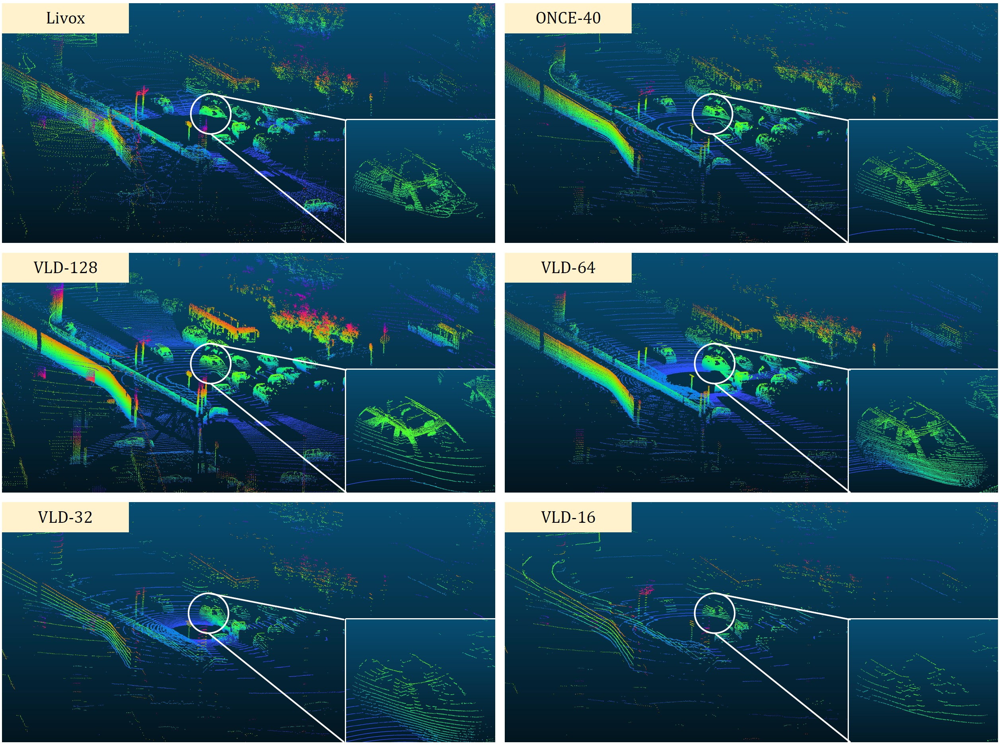

# LiDAR-CS

**LiDAR** Dataset with **C**ross-**S**ensors (LiDAR-CS Dataset), which contains large-scale annotated LiDAR point cloud under 6 groups of different sensors but with the same correspondence scenarios, captured from hybrid realistic LiDAR simulator. As far as we know, LiDAR-CS Dataset is the first dataset focused on the sensor (e.g., the points distribution) domain gaps for 3D object detection in real traffic.

**update**:

 We also provide point cloud data with different sensor heights (1.0m, 1.5m, 2.0m, 2.5m, 3.0m).

## Download

This is the official GitHub repository for LiDAR-CS dataset. 

1. The download links can be found in `download_data.sh`
2. We also support Baidu Yunpan. Link：[https://pan.baidu.com/s/1NyPziUeqfBSv6rgZBUspkQ](https://pan.baidu.com/s/1NyPziUeqfBSv6rgZBUspkQ) with extraction code: **x6o2** 


## Data Sample



## Getting Started

### 1. Data Prepare

Uncompress all the compressed files, for example

```
# For the normal compressed file
tar zxf VLD-16.tar.gz

# For the compressed file which is split due to the size limitation
cat VLD-128.tar.gz* | tar -zxf -
```

All the file will be organized as,

```
├── Livox
│   ├── bin
│   └── label
├── ONCE-40
│   ├── bin
│   └── label
├── VLD-128
│   ├── bin
│   └── label
├── VLD-16
│   ├── bin
│   └── label
├── VLD-32
│   ├── bin
│   └── label
└── VLD-64
│   ├── bin
│   └── label
└── splits
    ├── test.txt
    └── train.txt
```
    
### 2. Load Data

We follow KITTI to store the point cloud into binary files and the annotation results are stored in text files that are easy to parse.

Here is a python sample code to load the point cloud and the annotation file. 

```python
import numpy as np

def get_label(label_file):
    labels = np.loadtxt(label_file, dtype=str)
    if len(labels.shape) == 1:
        labels = labels[None, :]
    types, labels = labels[:, 0], labels[:, 1:].astype(np.float32)
    return types, labels

pc_path = 'VLD-16/bin/000000.bin'
label_path = 'VLD-16/label/000000.txt'

# the (x, y, z, intensity) are stored in binary
xyzi = np.fromfile(pc_path, dtype=np.float32).reshape(-1, 4) 

# types store the class names for the objects
# labels store a n * 7 ndarry and 7 is for (x, y, z, lenght, width, height, angle) in LiDAR coordinate.
types, labels = get_label(label_path) 

```


## Todo List

- [ ] More sensors will be supported.
- [ ] Update the evaluation code.
- [ ] Update the cross evaluation code.

## Changelog

+ **v1.0**: support 6 sensors, including VLD-16/32/64/128, Livox and ONCE-40
